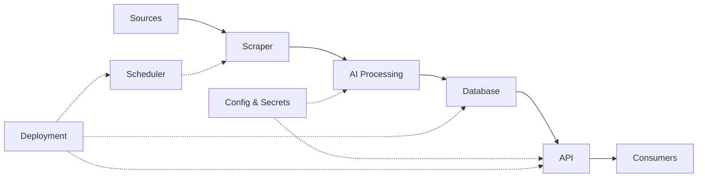

# AI News

An AI news platform that collects and standardizes news into PostgreSQL, exposes structured news
through API and also chunks and embeds article content so users can semantically search or ask
questions over the news using RAG.

## Design

Tech Stack
- Python
- Pydantic
- OpenAI API
- FastAPI
- SQLAlchemy
- PostgreSQL
- Docker
- uv
- Render

## Week 2 - Build a news scraping API

### Brief
Todays goals:
- Define which news I wanna scrape.
- Find sources to scrape. Find their APIs.
- Define what stuff will AI analyze.
    - Define the data model
- Write a scraper script I can run interactively with vscode jupyter intergration
    - save articles into 'output/' directory

### Goal
Scrape job posting boards for relevant jobs and distill the key `qualifications` they require.
    