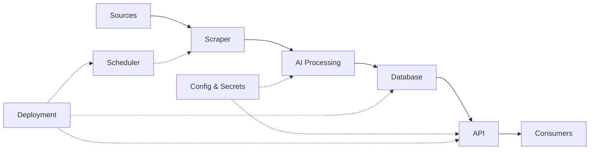

## Week 1 - High-level design

```mermaid
flowchart LR
    A["Sources"] --> B["Scraper"]
    B --> C["AI Processing"]
    C --> D["Database"]
    D --> E["API"]
    E --> F["Consumers"]

    S["Scheduler"] -.-> B
    G["Config & Secrets"] -.-> C
    G -.-> E
    H["Deployment"] -.-> D
    H -.-> E
    H -.-> S
```

Tech Stack
- Python
- Pydantic
- OpenAI API
- FastAPI
- SQLAlchemy
- PostgreSQL
- Docker
- uv
- Render
